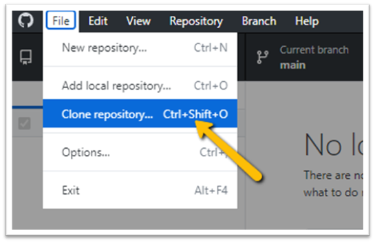
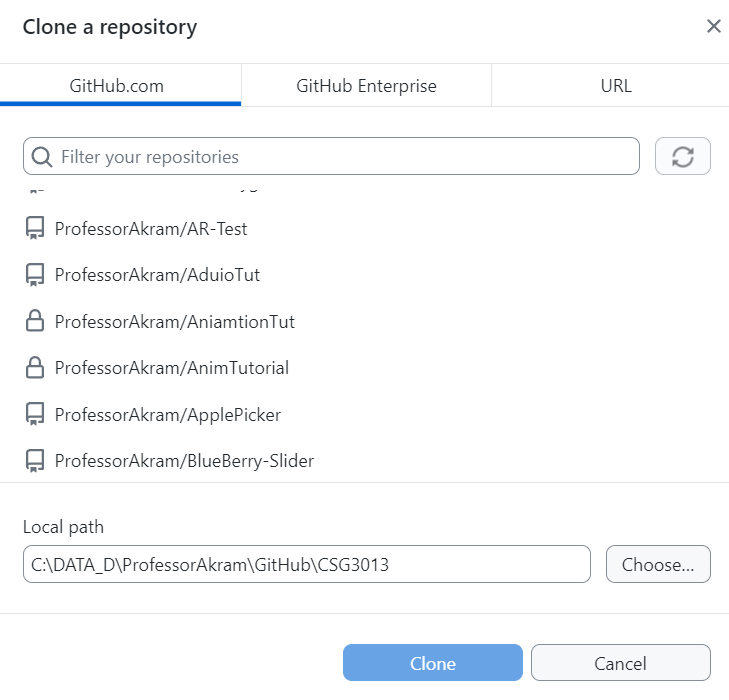
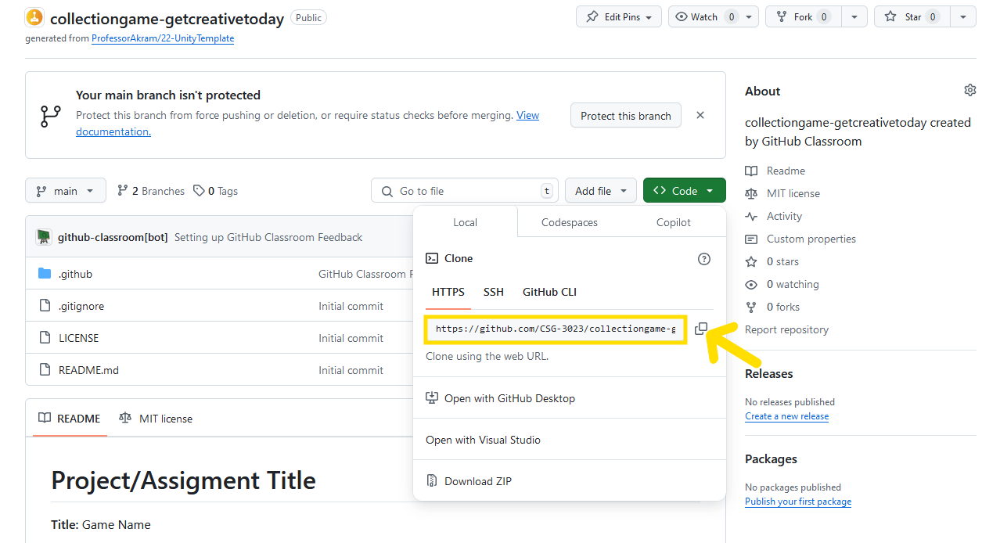
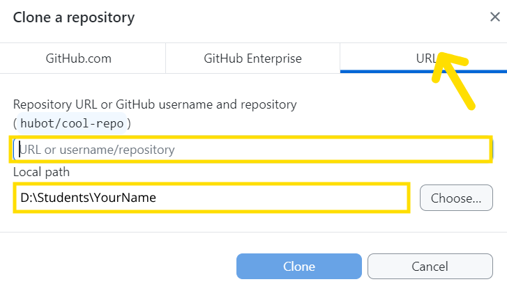

# 📜 Cloning a GitHub Repository
> By: Akram Taghavi-Burris | © 2026

When I hear the word **“clone,”** I instantly think of _Star Wars and the cloned Stormtroopers_. While they all originated from Mandalorian bounty hunter Jango Fett’s DNA, each clone eventually develops its **own traits and personality**.

Cloning in Git works in a similar way: you start with an identical copy of the original project, but your local version is **yours to work on independently**. Just like the clones train and operate on their own missions, your local repository allows you to experiment, make changes, and improve the project without altering the cloud-based version until you’re ready.

## Cloning a Git Repository

In typical GitHub workflows, we don’t work directly on the cloud version of a project. Instead, we **clone a repository**, creating a **local copy** of the project on your computer.  
-   This local clone starts with the **same folders, files, and code** as the cloud-based version; essentially, it has the same “DNA.”  
-   Change are made **locally** without affecting the original repository.
-   When ready, we **push** these changes back to the cloud, updating the original repository with your improvements.
    
In short, cloning gives you a **safe, personal copy** of the project, so you can work locally while keeping the master copy intact.

## 📁 Choosing a Good Clone Location

Where you **clone your repository** is critically important in game development. By default, GitHub Desktop suggests cloning into your **Documents** folder, but this is often not ideal.

The Documents folder tends to get cluttered with downloads, personal files, and other projects. If it’s synced to a cloud service like OneDrive, Google Drive, Dropbox, or iCloud, this can **cause serious issues** with game engine projects:

-   Files may become **locked** or unavailable while syncing
-   Projects can **corrupt** or break unexpectedly
-   Long folder paths combined with spaces can cause **Windows or application errors**
    
> [!IMPORTANT]  
> **Do not** clone Unity or Unreal projects into cloud-synced folders.
>

#

### Organizing Your Projects

Maintaining a **consistent folder structure** is a best practice in professional development. Developers often organize repositories by **organization** and **project**, making it easier to find and manage code.

In classroom settings, instructors may recommend a specific location for student projects. 

For example:
- `D:\Students\YourName\CoursePrefixNumber\`  
    - _(e.g., `D:\Students\BobBaloney\CSG3013\`)_

> [!TIP]  
> Always use a **consistent folder structure** for all assignments. This prevents the dreaded “Where did my project go?” problem and keeps your work organized.
>

#

### Folder Naming Guidelines

It’s important to avoid spaces in folder names. While allowed, spaces can:

-   Create **long character paths** that may break Windows or some applications
-   Complicated command-line operations
    
Use **hyphens (`-`)** for folder names and project names
-   Combine with **PascalCase or lowercase** as needed for clarity:
    -   Example: `CSG3013-Assignment1` (PascalCase + hyphen)
    -   Example: `csg3013-assignment1` (lowercase + hyphen)    

> [!TIP]  
> Avoid spaces and special characters entirely. Hyphens are easier to read, type, and share across systems, keeping your workflow consistent and professional.
> Whether you use PascalCase or lowercase, be consistent with your naming conventions across all projects and folders.
> 

# 
    

## 🛠️ TUTORIAL: Cloning Your Repository (GitHub Desktop)

<strong><em>Tutorial Details</em></strong>

|📝 Topic          | 🕑 Estimated Time | 🧰 Requirements   |
| :---------------: | :---------------: | :---------------: |
| Project Managment | 5 minutes        |   GitHub Desktop, Git   |

### Step 1: Open GitHub Desktop and Log In

1.  **Open the GitHub Desktop app** on your computer.
2.  **Check your account:**
    -   If you’ve logged in previously, you should already be signed in.
    -   If not, you will be prompted to **log in to GitHub**.
        
3.  **Verify the correct account is active:**
    -   Go to **File > Options (Windows)** 
        - **GitHub Desktop > Preferences (Mac)**
    -   Make sure the account matches the one connected to your course.
    -   If someone else is logged in, **sign out** and log in with your own GitHub account.        

> [!IMPORTANT]  
> If you are logged into the wrong account, your classroom repositories will **not appear** in the list.
>

#

### Step 2: Clone the Repository

1.  In GitHub Desktop, choose **File > Clone Repository**

#

### Step 3: Select Your Repository

A window will list repositories associated with your GitHub account.

1. From the **GitHub.com** tab
   - Find the assignment repository
   - Select the repo by clicking once on it 

> [!CAUTION]
> #### DO NOT PRESS CLONE!
> Before pressing clone, you must verify where the clone will be saved.
> See the next section on Choosing a Clone Location below.
>
    
> [!WARNING] 
> If you don’t see your assignment repository (common for GitHub Classroom assignments), clone the repo using the **URL method** outlined in [Step 4: Clone via Git URL](#step-5-choosing-a-clone-location)
> Otherwise, skip to [Step 5: Choosing a Clone Location](#step-5-choosing-a-clone-location)
>

# 

### Step 4: Clone via Git URL
Alternatively, you can clone a GitHub repo using the Git URL.

1. In a browser, navigate to the GitHub repo you want to clone
2. On your repository page, click the green **`Code`** button
3.  Select the **HTTPS** tab
4.  Click **Copy** to copy the repository URL

> [!TIP]  
> For this course, always use **HTTPS**, not SSH.  
> SSH is powerful, but it requires extra setup that beginners don’t need yet.
>

5. Return to GitHub Desktop
6. With the **Clone Repository** window still open, click the **URL** tab
7. Paste the **HTTPS** repository URL from GitHub

> [!CAUTION]
> #### DO NOT PRESS CLONE!
> Before pressing clone, you must verify where the clone will be saved.
> See the next section on Choosing a Clone Location below.
>

# 
    
### Step 5: Choosing a Clone Location
1. In the **Clone Repository** window, **set** the **Local path**
2. **Choose** a location that follows the rules above for a [good cloning location](#-choosing-a-good-clone-location)
3. Once the path is chosen, press **`Clone`**  
    
---

# 🎉 New Achievement: Repository Cloned!
You’ve successfully cloned your GitHub repository to your local computer. You now have a **personal, working copy** of your assignment and can safely make changes. When ready, you can **commit your work** and **push it back to GitHub**, following the same workflow used by professional developers.

## 🛡️ Checkpoint

Key takeaways from this lesson:

-   **GitHub Classroom** is built on GitHub but adds classroom-specific features for assignments.
-   **Your repository is not created** until you accept the assignment link.
-   **Cloning** creates a local copy of your assignment so you can work offline.
-   **GitHub Desktop** provides a beginner-friendly way to clone and manage repositories.
-   **Avoid cloud-synced folders** when working with game engine projects to prevent corruption.
-   **Pick a consistent local folder** to store all your projects for easier organization.
