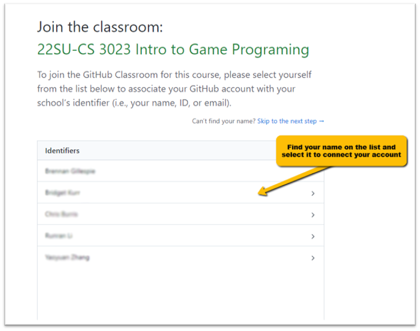
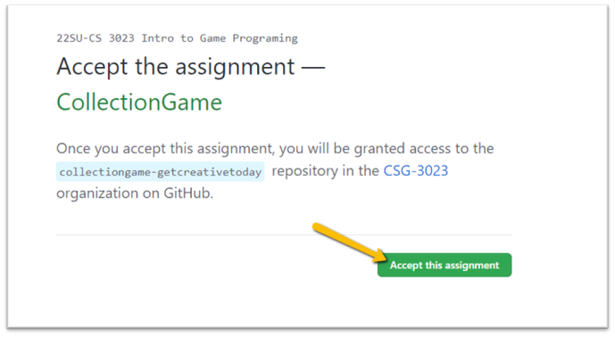

# 📜 Using GitHub Classroom
> By: Akram Taghavi-Burris | © 2026

Git is not just a tool for professional software teams — it can be used for **any type of project**, whether you are working alone on a personal project or collaborating on a large production.

In educational settings, many instructors take advantage of a tool called **GitHub Classroom**. This system is designed to make Git-based assignments easier to distribute, manage, and submit while still using the same workflow you would see in real-world development studios.

## What is GitHub Classroom?

**GitHub Classroom** is an educational platform built on top of **GitHub** that allows instructors to create and manage assignments using Git repositories.

Instead of students manually creating repositories and uploading files, GitHub Classroom automates the entire process.

With GitHub Classroom, instructors can:

-   Create assignments that generate **individual student repositories**
-   Provide **starter code** automatically
-   Organize all submissions under the school’s GitHub Organization
-   Ensure every student uses the same repo structure and naming conventions
-   Collect work using an industry-standard workflow (clone → commit → push)
    
#

### Why Instructors Use It

In a traditional class, students might submit work by uploading a ZIP file to the LMS.

GitHub Classroom replaces that workflow with something much closer to professional development:

-   Your project lives in a real repository
-   Your progress is tracked through commits
-   Your work is backed up online
-   Submitting is as simple as pushing your latest changes

This is especially important in **game development**, where projects often include large files (textures, models, audio) that don’t upload well through an LMS. With tools like **`.gitignore`** and **Git LFS**, GitHub Classroom makes it possible to submit game projects cleanly without constantly re-uploading massive ZIP files.

> [!TIP]  
> GitHub Classroom isn’t just a submission tool! Instead of fighting with huge ZIP uploads, students use the same industry-standard workflow professional teams use to manage large projects: **clone → commit → push**.
    
--- 
## GitHub vs GitHub Classroom

Even though GitHub Classroom uses GitHub behind the scenes, classroom **assignment repositories work differently** than normal GitHub projects.

#

### Assignment Repositories Are Not Created Until You Accept

In GitHub Classroom, you cannot access an assignment repository until you first click the link and **Accept the Assignment**.

> [!IMPORTANT]  
> If you do not accept the assignment, your repository will not exist yet.

#

### Your Assignment Repo Lives Inside the Course Organization

Another key difference is where the repository is hosted.

GitHub Classroom repositories are typically created inside your school or course’s **GitHub Organization**, not under your personal account. Because of this:
-   The repository may not appear on your personal GitHub profile
-   Your instructor controls how the repository is configured
-   You may or may not have full admin permissions (depending on course settings)
    
> [!NOTE]  
> Even though the repository is inside the organization, it is still _your_ assignment repository — and it will track your commits, history, and submissions.

#

### Classroom Assignments Use a Fork-Style Workflow
Many GitHub Classroom assignments are generated from a starter repository. When you accept the assignment, GitHub Classroom creates your own copy of that project, using a **fork** workflow.

A **fork** is a GitHub feature that creates a copy of an existing repository under a new owner.

In other words:

-   The instructor provides a “starter repo” (template code)
-   When you accept the assignment, GitHub creates your personal copy
-   Your repository begins with the same files, folders, and structure as the starter project

> [!IMPORTANT]  
> Due to their fork-style workflow, GitHub Classroom Assignment repos may display messages like:
> - “This branch is behind the upstream repository”
> - “Contribute to this project.”
> - “Open a pull request”
>
> **Ignore these messages.**  
> These are GitHub’s standard collaboration tools, but for assignments, you are not contributing back to the starter repo; you are completing your own assignment repository.

---

## 🛠️ TUTORIAL: Accepting a GitHub Classroom Assignment

<strong><em>Tutorial Details</em></strong>

|📝 Topic          | 🕑 Estimated Time | 🧰 Requirements   |
| :---------------: | :---------------: | :---------------: |
| Project Managment | 5 minutes        |   GitHub Account    |

### Step 1: Connect Your GitHub Account to the Classroom

Before you can submit assignments, you must connect your GitHub account to the course.

1.  **Open the classroom link** provided by your instructor
    -   You can usually find this link in the course LMS (Canvas, Blackboard, etc.)
        
2.  **Select your name from the student list**
    -   This links your GitHub account to your identity in the course
        
3.  **Confirm and join the GitHub Classroom**

    

> [!WARNING]  
> Some courses will show a list of student names. Others will not.
> If you don’t see a student list, **don’t panic**, accepting the first assignment link will usually auto-enroll you into the course Classroom.

#

### Step 2: Accept the Assignment

Each GitHub Classroom assignment generates a **new repository** specifically for you.

1.  **Click the assignment link** provided by your instructor
    
2.  Press **`Accept the assignment`**
    
3.  Wait while GitHub generates your repository

    
    

> [!IMPORTANT]  
> After accepting the assignment, you might see a message saying that you **_"do not have access to the repository"_**.
> 
> This happens because you also need to accept the **invite to the course or institution GitHub Organization**.  
> The invite will appear in your GitHub inbox shortly after accepting the assignment.
> 
> Once you accept the invite, you will have full access to your assignment repository.

#

### Step 3: View Your Repository

Once the assignment is accepted:

1.  Refresh the assignment page
2.  Look for a message showing your repository link
3.  Click the link to open your repository on GitHub
    
At this point, your assignment exists online, but you still need a **local copy** to actually work on it.

---

